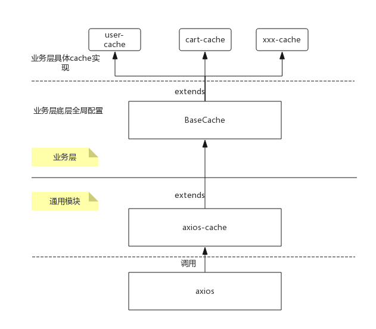

## axios-cache

基于[axios](https://github.com/axios/axios)库封装的集中管理异步请求配置的模块。根据业务需求及开发习惯，参考[NEJ](https://github.com/genify/nej)的cache使用方式，在保持axios原有配置方式上进行功能的增强，使异步接口更加方便统一管理、使用方式更符合日常开发习惯

## 何为cache
此cache说的并不是日常所说的浏览器/服务器缓存。cache也只是一个抽象概念的统称，具体映射的是对象实体的全部接口的集合。比如`用户`为一个实体对象，与`用户`这个实体相关的所有CRUD接口操作都统一放在`user`这个cache中，方便集中管理与维护

目前只支持异步接口的管理，如果后续集成redux等数据状态管理容器做数据的缓存与管理，命名为cache也是说得过去的。


## 功能

- 接口配置与接口方法统一管理
- 配置异步接口中后端返回http状态码与前端使用状态码映射规则，方便底层做统一处理
- 请求接口支持restful风格API，自动替换API中参数
- 支持非异步接口新窗口打开规则
- 支持服务端返回状态码重置
- 支持请求前、后介入做数据处理，抹平请求参数、返回数据格式差异
- 支持异步接口取本地配置mock数据 (只建议临时使用)
- 支持配置mock服务器地址，使本地可以访问任何服务器接口(跨域需服务端配合)

## 安装
```
npm install axios-cache --save
```

## 使用方法
**cache使用工程结构样例**


```
├── src
│   ├── App.js
│   ├── cache
│   │   ├── base
│   │   │   ├── cache.js
│   │   │   ├── config.js
│   │   │   └── setting.js
│   │   ├── icon
│   │   │   ├── cache.js
│   │   │   └── config.js
│   │   ├── repo
│   │   │   ├── cache.js
│   │   │   └── config.js
│   │   └── user
│   │       ├── cache.js
│   │       └── config.js

......

```

## 模块层级图


**底层实现流程图**
[底层实现流程图](./docs/接口配置及接口调用底层具体实现流程图.png)

### 一、 工程接入做底层配置及错误统一处理
**前后端返回状态码映射规则配置**

```
// cache/base/setting.js

// 后端返回数据格式定义
// 后端操作成功
// {
//     code: 0,
//     result: true | Array | Object | ...
//     message: ""
// }

// 后端操作失败
// {
//     code: 0,
//     result: false | null
//     message: "后端返回的错误信息，由前端上层toast或弹框显示或input框报错"
// }

// 后端操作通用提示
// {
//     code: -5,
//     result: null
//     message: "后端返回的错误信息，统一toast处理"
// }

// 后端操作通用提示
// {
//     code: -10,
//     result: null
//     message: "后端返回的错误信息，统一弹框处理"
// }

export default {
    // 服务器状态码
    httpStatus: {
        CODE_OK: [200, 201, 202, 203, 204, 205, 206], // 成功
        CODE_WARM: [100, 101], // 警告
        CODE_ERROR: [500, 501, 502, 503, 504, 505], // 内部错误
        CODE_NO_AUTH: [401], // 未登录
        CODE_NO_PRIVILEGE: [403] // 无权限
    },
    // 客户端专题码
    clientCode: {
        CODE_OK: 0, // 成功 业务层处理
        CODE_WARM: -5, // 错误 全局toast提示
        CODE_ERROR: -10, // 错误 全局弹框报错
        CODE_NO_AUTH: -30, // 未登录 全局弹登陆框或跳转登陆页
        CODE_NO_PRIVILEGE: -50 // 无权限 跳转无权限页
    }
}
```

**配置全局基本配置及请求前后对数据处理的方法**

```
// cache/base/config.js

export default {
    // 需要开启mock时的server url
    mockBaseURL: '',
    /**
     * 请求发送之前对数据、配置进行处理
     *
     * @param    {Object}           conf                     请求配置、数据
     * @return   {void}
     */
    filter: function (conf) {

    },
    /**
     * 服务器返回的原始数据，对该数据进行整理，符合axios-cache数据格式
     *
     * @param    {Object}           result                   服务起返回原始数据
     * @param    {Object}           conf                     请求配置、数据
     * @return   {void}
     */
    post: function (result, conf) {

    },
    /**
     * 格式化返回数据，符合view层展示需求
     *
     * @param    {Object}           result                   服务起返回原始数据
     * @param    {Object}           conf                     请求配置、数据
     * @return   {void}
     */
    format: function (result, conf) {

    }
}

```


**配置覆盖及底层统一做错误处理**

```
// cache/base/cache.js

import AxiosCache from 'axios-cache'
import config from './config'
import setting from './setting'
import {Message, Modal} from 'iview'

const CACHE_KEY = 'axios-cache'
export default class BaseCache extends AxiosCache {
    constructor () {
        super()
        this.globalCacheKey = CACHE_KEY
    }

    init () {
        super.init()
        // 设置工程通用请求配置
        this.doFlushSetting(this.globalCacheKey, config)
        // 设置后端返回状态码与客户端状态码对应关系
        this.doMapStatusCode(setting.httpStatus, setting.clientCode)
    }

    /**
     * 处理后端返回错误状态码，子类重写
     * @override
     *
     * @param       {Integer}   code        客户端状态码
     * @param       {Object}    result      客户端返回的数据
     * @return      {void}
     */
    handleErrorCase (code, result) {
        switch (code) {
        case setting.clientCode.CODE_WARM:
            // before show this modal is removing another modal, because executing destroy
            Message.info({
                title: '错误提示！',
                content: result.message
            })
            break
        case setting.clientCode.CODE_ERROR:
        case setting.clientCode.CODE_NO_AUTH:
        case setting.clientCode.CODE_NO_PRIVILEGE:
            Modal.error({
                    title: '错误提示！',
                    content: result.message
                })
            break
        default:
            console.log('code ' + code + ', message ' + result.message)
        }
    }
}

```
### 二、上层业务具体cache实现

**cache 接口配置**

```
// user/cache.js

export default {
    'user-get': {
        url: '/api/user/:userId/get',
        method: 'get',
        rest: true
    }
}
```

**cache 接口API**

```
import config from './config'
import BaseCache from '../base/cache'

const CACHE_KEY = 'login_cache_key'
export default class LoginCache extends BaseCache {
    constructor () {
        super()
        this.settingKey = CACHE_KEY
    }

    init () {
        super.init()
        this.doFlushSetting(
            CACHE_KEY, config
        )
    }
    /**
     * 获取用户基本信息
     *
     * @param    {Object}           options        请求对象
     * @return   {void}
     */
    getUserInfo (options) {
        this.sendRequest(
            'user-get', options
        )
    }
}
```

### 三、具体业务调用cache

```
    import Base from './base.vue'
    import UserCache from '@/cache/user/cache'

    export default Base.extend({
        name: 'app',
        methods: {
            onGetUserInfo (result) {
                window.webUser = result.result
                this.$store.commit('webUser', result.result)
            }
        },
        created: function () {
            this.userCache = new UserCache({})
            this.userCache.getUserInfo({
                data: {
                	userId: 123
                },
                onload: this.onGetUserInfo.bind(this)
            })
        }
    })
```

当然，如果你习惯使用`Promise`风格的请求方式也是可以的

```
	....
	
    this.userCache = new UserCache({})
    this.userCache.getCurLoginUserInfo({
        data: {}
    }).then((result) => {
        this.onGetUserInfo(result)
    }).then((result) => {
        console.log(result);
    })
```

## 功能配置说明
**请求接口支持restful风格API，自动替换API中参数**

接口配置：

```
'user-get': {
    url: '/api/user/:userId/get',
    method: 'get',
    rest: true
},
```
接口调用传参

```
    this.userCache.getUserInfo({
        data: {
        	userId: 123
        },
        onload: this.onGetUserInfo.bind(this)
    })
```

接口最终变成 `/api/user/123/get`, url中参数的替换来源于接口调用时`data`或`params`对象中的同名属性的值, 只要接口配置中加`rest: true`就会执行替换

**支持非异步接口新窗口打开规则**

接口配置：

```
	'icon-download': {
	    url: '/api/icon/download/:iconId',
	    method: 'get',
	    rest: true,
	    ajax: false,
	    target: '_self'
	}
```
接口调用时跳转到该接口

```
	// 源码实现
    // 非异步接口
    if (conf.ajax === false) {
        window.open(conf.url, conf.target ? conf.target : '_blank')
        return
    }
```


**支持服务端返回状态码重置**

接口配置：

```
	'icon-download': {
	    url: '/api/icon/download/:iconId',
	    method: 'get',
	    rest: true,
	    resetReturnCode: 200
	 }
```
不管后端然后状态码是什么，返回的code都会被设置为200，然后调用onload方法

**支持请求前、后介入做数据处理，抹平请求参数、返回数据格式差异**

接口配置：

```
	    'clans-list': {
        url: '/clans/v1/getPublicClans',
        method: 'get',
        mock: clans.listView,
        filter: function (conf) {
            // request add headers edu_token before send request
            Object.assign(conf.headers || {}, {
                'edu_token': '123456'
            })
        },
        // server response {result: true|false}
        post: function (result, options) {
        	// format return data to {code: xx, result: xxx, message:xxx}
            if (result.result) {
                result.code = 200
                result.message = '操作成功'
            } else {
                result.code = 500
                result.message = '操作失败'
            }
        },
        format: function (result, options) {
        	// response data ok, format it to show
            for (let item of (result.result || [])) {
                item.membersLabel = item.memberCount || (item.members || []).length
                item.typeLabel = (item.type === 'public' ? '公开' : '私有')
            }
        }
    }
```
对于异步请求的介入方法有三个

- filter	请求为发送前对发送的数据、配置做处理
- post		服务端返回的原始数据，对数据做处理成`{code:xx, result:xxx, message: xx}`格式
- format  改方法属于服务端已经正确返回，在onload之前做数据格式化以符合展示需求

请求的介入会先调用全局配置的filter、post、format统一处理，单个接口需额外处理只需在该接口配置中添加这几个方法

**支持异步接口取本地配置mock数据**

```
    'clans-join': {
        url: '/clans/v1/joinClans/:clansId',
        method: 'put',
        rest: true,
        mock: {
            "code": 200,
            "message": "",
            "result": true
        }
    }
```
对于前端在本地开发更方便的走通流程，提供异步请求直接获取mock属性的数据，不发异步请求。当配置的`mock`属性存在切当前host是`localhost`时才会起效。但是这样做的后果是不好维护，上线需要手动删除或者在构建过程自动删除

**支持配置mock服务器地址，使本地可以访问任何服务器接口(跨域需服务端配合)**

对于有独立启动的服务，只需要调试异步接口时，可能需要调试测试、线上环境的数据。类似于dev-server可以独立起服务的应用, 在本地开发时需要联调测试环境的数据，只需要在全局接口配置中指定`mockBaseURL`的服务器地址就好。或者在单个接口中设置`baseURL`，并带上相应的headers

```
// cache/base/config.js

export default {
    mockBaseURL: 'proxy.server.com'
}
```


底层更多接口详细配置请参考[axios](https://github.com/axios/axios)

## 项目参考
`axios-cache`模块是我在开发[字体图标库管理平台](http://icon.bolin.site/#/)时所提取出来的模块，具体的使用方式可以参考该项目 [nicon-front](https://github.com/bolin-L/nicon-front), 如有问题或建议，欢迎交流指导。


## 单元测试
待补充....

## License
MIT